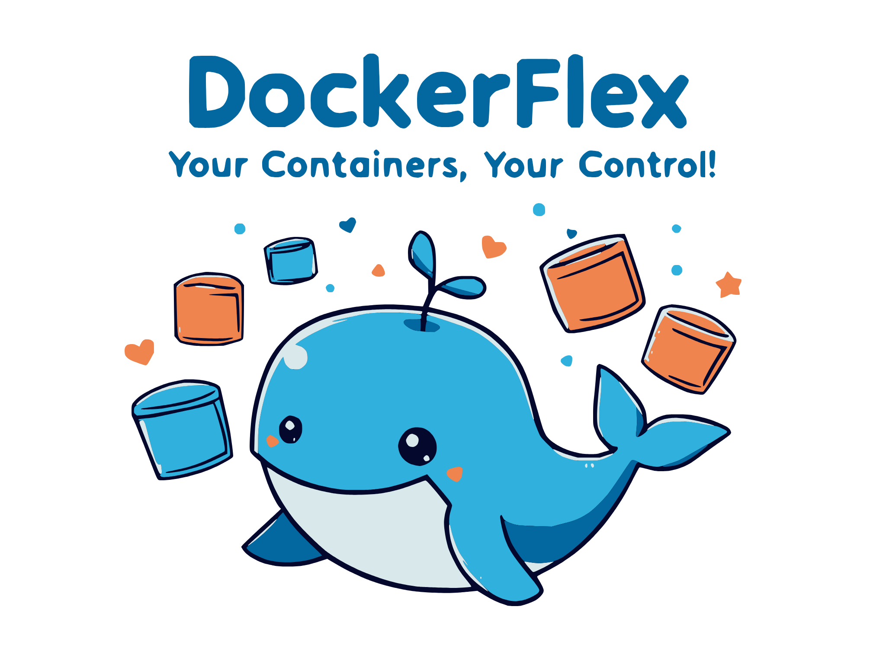

<div align="center">
  
  
  # DockerFlex
  
  > The missing file manager for Docker containers
  
  *Manage Docker container files with elegance - your containers, your control*
</div>

## 🚀 Overview

DockerFlex is a modern web-based application that simplifies Docker container file management. Whether you're a developer, DevOps engineer, or system administrator, DockerFlex provides an intuitive interface for managing container files without the complexity of traditional tools.

## ✨ Key Features

- 🔍 **Container Overview**
  - View all Docker containers and their status
  - Quick access to container details
  - Real-time status updates

- 📁 **File Management**
  - Browse container files with an intuitive interface
  - Upload files and folders with drag-and-drop
  - Download files and directories
  - Edit files directly in the browser
  - Delete files and folders
  - Create new files and directories

- 🛠 **Developer Experience**
  - Clean, modern interface
  - Fast and responsive
  - Cross-platform compatibility
  - No installation required (web-based)

## 🚀 Getting Started

### Prerequisites

- Docker and Docker Compose
- Git (for cloning the repository)

### Quick Start

1. Clone the repository:
   ```bash
   git clone <repository-url>
   cd dockerflex
   ```

2. Start the application:
   ```bash
   docker compose up --build
   ```

3. Access DockerFlex:
   - Web Interface: [http://localhost:3000](http://localhost:3000)
   - API Endpoint: [http://localhost:4000](http://localhost:4000)

## 🔧 Development

### Local Development Setup

1. Start services:
   ```bash
   docker compose up -d
   ```

2. Development features:
   - Hot reload for frontend
   - Auto-restart for backend
   - Volume mounts for local development

### Debugging

View logs:
```bash
# All services
docker compose logs

# Specific service
docker compose logs frontend
docker compose logs backend
```

## 🔒 Security Considerations

- Implement authentication before production use
- Restrict Docker socket access
- Set appropriate file upload limits
- Enable HTTPS in production
- Validate file operations

## 🤝 Contributing

1. Fork the repository
2. Create your feature branch
3. Commit your changes
4. Push to the branch
5. Create a Pull Request

## 📝 License

This project is licensed under the MIT License.

## 💬 Support

- GitHub Issues: Report bugs and feature requests
- Documentation: Check inline code comments
- Contact: Reach maintainers through GitHub

## 🎉 Acknowledgments

Special thanks to all contributors who have helped make DockerFlex better!

---

<div align="center">
  <sub>Built with ❤️ for the Docker community</sub>
</div>