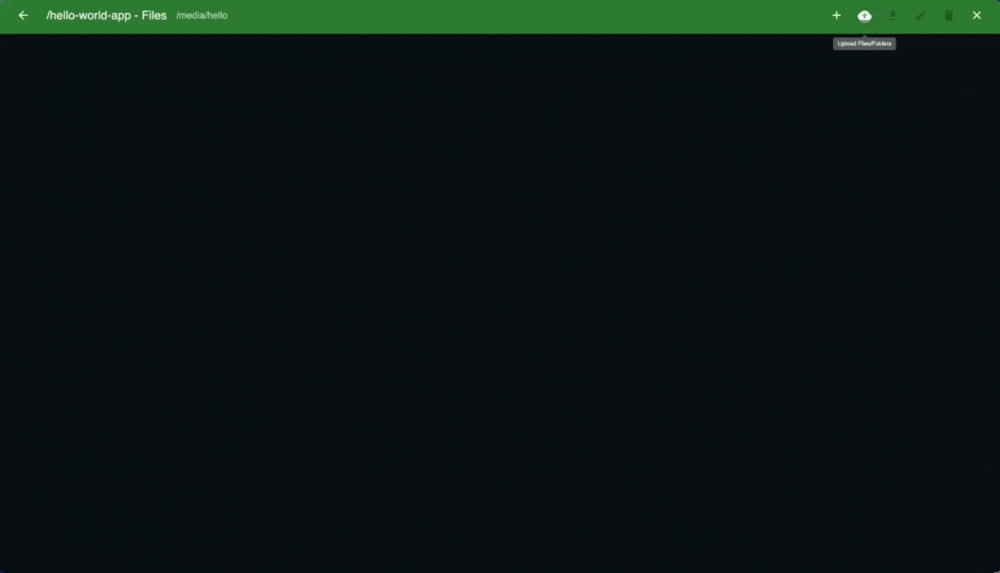

<div align="center">
  
  
  # DockerFlex
  
  > The missing file manager for Docker containers
  
  *Manage Docker container files with elegance - your containers, your control*

  [](https://hub.docker.com/r/mbakgun/dockerflex-frontend)
  [](https://hub.docker.com/r/mbakgun/dockerflex-backend)
  [](https://github.com/mbakgun/dockerflex/blob/master/LICENSE)
  [](https://github.com/mbakgun/dockerflex)

</div>

<p align="center">
  <a href="#-overview">Overview</a> •
  <a href="#-key-features">Features</a> •
  <a href="#-getting-started">Getting Started</a> •
  <a href="#-development">Development</a> •
  <a href="#-contributing">Contributing</a>
</p>

## 🚀 Overview

DockerFlex is a modern web-based application that simplifies Docker container file management. Whether you're a developer, DevOps engineer, or system administrator, DockerFlex provides an intuitive interface for managing container files without the complexity of traditional tools.

<br>

<div align="center">
  
</div>

## ✨ Key Features

- 🔍 **Container Overview**
  - View all Docker containers and their status
  - Quick access to container details
  - Real-time status updates

- 📁 **File Management**
  - Browse container files with an intuitive interface
  - Upload files and folders with drag-and-drop
  - Download files and directories
  - Edit files directly in the browser
  - Delete files and folders
  - Create new files and directories

- 🛠 **Developer Experience**
  - Clean, modern interface
  - Fast and responsive
  - Cross-platform compatibility
  - No installation required (web-based)

## 🚀 Installation

### Quick Start

1. Run with a single command:
   ```bash
   curl -O https://raw.githubusercontent.com/mbakgun/dockerflex/master/docker-compose.yml
   docker compose up -d
   ```

2. Access DockerFlex:
   - Web Interface: [http://localhost:3200](http://localhost:3200)
   - API Endpoint: [http://localhost:4200](http://localhost:4200)

### Configuration Options

1. Environment Variables:

   | Variable | Description | Default |
   |----------|-------------|---------|
   | VITE_HOSTNAME | Custom hostname display | Docker Desktop |
   | VITE_API_URL | Custom API endpoint URL | http://localhost:4200 |

2. Example Configurations:

   Basic setup (docker-compose.yml):
   ```yaml
   version: '3.8'
   services:
     frontend:
       image: mbakgun/dockerflex-frontend:latest
       ports:
         - "3200:3200"
       environment:
         - VITE_API_URL=http://localhost:4200
       networks:
         - app-network

     backend:
       image: mbakgun/dockerflex-backend:latest
       ports:
         - "4200:4200"
       volumes:
         - /var/run/docker.sock:/var/run/docker.sock
       networks:
         - app-network

   networks:
     app-network:
       driver: bridge
   ```

   Custom settings (example):
   ```yaml
   services:
     frontend:
       image: mbakgun/dockerflex-frontend:latest
       environment:
         - VITE_HOSTNAME=Production Server    # Custom hostname
         - VITE_API_URL=http://192.168.1.100:4200  # Internal network API
       ports:
         - "3200:3200"
   ```

### Network Configuration

1. Local Development:
   - Default setup works out of the box
   - Frontend and backend communicate via Docker network

2. Internal Network:
   - Set VITE_API_URL to your backend's internal IP
   - Example: `VITE_API_URL=http://192.168.1.100:4200`

3. Remote Access:
   - Ensure ports 3200 and 4200 are accessible
   - Configure VITE_API_URL to point to your backend server
   - Use appropriate hostname in VITE_HOSTNAME

### Troubleshooting

Common issues and solutions:
- If hostname isn't updating, ensure VITE_HOSTNAME is properly set in your environment
- For API connection issues, verify VITE_API_URL is correctly configured
- Container access requires proper Docker socket mounting

## 🔧 Development

### Local Development Setup

1. Clone the repository:
   ```bash
   git clone https://github.com/mbakgun/dockerflex.git
   cd dockerflex
   ```

2. Start local development:
   ```bash
   # Stop any running instances
   docker compose down
   
   # Build and start with local changes
   docker compose -f docker-compose-local.yml up --build
   ```

3. Development features:
   - Hot reload for frontend
   - Auto-restart for backend
   - Volume mounts for local development
   - Local changes reflected immediately

### Debugging

View logs:
```bash
# All services
docker compose logs

# Specific service
docker compose logs frontend
docker compose logs backend
```

<div>
  
</div>

## 🔒 Security Considerations

- Implement authentication before production use
- Restrict Docker socket access
- Set appropriate file upload limits
- Enable HTTPS in production
- Validate file operations

## 🤝 Contributing

1. Fork the repository
2. Create your feature branch
3. Commit your changes
4. Push to the branch
5. Create a Pull Request

## 📝 License

This project is licensed under the MIT License.

## 💬 Support

- GitHub Issues: Report bugs and feature requests
- Documentation: Check inline code comments
- Contact: Reach maintainers through GitHub

## 💰 Donations

If you find DockerFlex helpful, consider supporting its development through cryptocurrency donations:

<details>
<summary>🪙 Cryptocurrency Wallets</summary>

| Coin | Network | Wallet Address |
|------|---------|----------------|
| USDT | ERC20   | `0x093bA9f00a2cdaAC9d70b625644b592BD3C96AF2` |
| DASH | DASH    | `Xh6VgfeTasdQEdErouoYbWWqZbQR9nLZen` |
| SOL  | SOL     | `DF67UJ4QzVNVGKKWyEeA88hBCL54L1aMbadG794UrNp8` |

<div align="center">
  <sub>All donations go towards maintaining and improving DockerFlex</sub>
</div>
</details>

## 🎉 Acknowledgments

Special thanks to all contributors who have helped make DockerFlex better!

---

<div align="center">
  <sub>Built with ❤️ for the Docker community</sub>
</div>

<br>