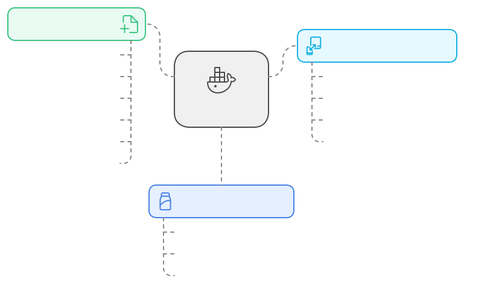

<div align="center">
  
  
  # DockerFlex
  
  > The missing file manager for Docker containers
  
  *Manage Docker container files with elegance - your containers, your control*

  [](https://hub.docker.com/r/mbakgun/dockerflex-backend)
  [](https://github.com/mbakgun/dockerflex/blob/master/LICENSE)
  [](https://github.com/mbakgun/dockerflex)

</div>

<p align="center">
  <a href="#-overview">Overview</a> •
  <a href="#-key-features">Features</a> •
  <a href="#-installation">Getting Started</a> •
  <a href="#-development">Development</a> •
  <a href="#-contributing">Contributing</a>
</p>

<div align="left">
  
</div>

## 🚀 Overview

DockerFlex is a modern web-based application that simplifies Docker container file management. Whether you're a developer, DevOps engineer, or system administrator, DockerFlex provides an intuitive interface for managing container files without the complexity of traditional tools.

<br>

<div align="center">
  
</div>

## ✨ Key Features

- 🔍 **Container Overview**
  - View all Docker containers and their status
  - Quick access to container details
  - Real-time status updates

- 📁 **File Management**
  - Browse container files with an intuitive interface
  - Upload files and folders with drag-and-drop
  - Download files and directories
  - Edit files directly in the browser
  - Delete files and folders
  - Create new files and directories

> 💡 For a comprehensive list of features and capabilities, check out our detailed [Features Guide](features.md).

---

<div align="left">
  
</div>

---

## 🤝 Contributing

1. Fork the repository
2. Create your feature branch
3. Commit your changes
4. Push to the branch
5. Create a Pull Request

## ✍️ Version History

DockerFlex is currently at version v1.0.1. For detailed information about changes and improvements in each version, please see our [CHANGELOG](CHANGELOG.md).

Latest updates include drag & drop support for parent directory operations, improved file/folder rename functionality, and various bug fixes. See the changelog for complete details.

<div align="left">
  
</div>

## 📝 License

This project is licensed under the MIT License.

## 💬 Support

- GitHub Issues: Report bugs and feature requests
- Documentation: Check inline code comments
- Contact: Reach me through GitHub

## 💰 Donations

If you find DockerFlex helpful, consider supporting its development through cryptocurrency donations:

<details>
<summary>🪙 Cryptocurrency Wallets</summary>

| Coin | Network | Wallet Address |
|------|---------|----------------|
| USDT | ERC20   | `0x093bA9f00a2cdaAC9d70b625644b592BD3C96AF2` |
| DASH | DASH    | `Xh6VgfeTasdQEdErouoYbWWqZbQR9nLZen` |
| SOL  | SOL     | `DF67UJ4QzVNVGKKWyEeA88hBCL54L1aMbadG794UrNp8` |

<div align="center">
  <sub>All donations go towards maintaining and improving DockerFlex</sub>
</div>
</details>

## 🎉 Acknowledgments

Special thanks to all contributors who have helped make DockerFlex better!

---

<div align="center">
  <sub>Built with ❤️ for the Docker community</sub>
</div>

<br>

## 🔒 Security

### Master Password Protection

DockerFlex supports optional master password protection for enhanced security. To enable this feature:

1. Set the `MASTER_PASSWORD` environment variable in your docker-compose file:

```yaml
services:
  frontend:
    image: mbakgun/dockerflex-frontend:latest
    hostname: dockerflex-frontend
    container_name: dockerflex-frontend
    restart: unless-stopped
    ports:
      - "3200:3200"
    environment:
      - VITE_API_URL=/api
      - VITE_BACKEND_URL=http://backend:4200
    networks:
      - app-network

  backend:
    image: mbakgun/dockerflex-backend:latest
    hostname: dockerflex-backend
    container_name: dockerflex-backend
    restart: unless-stopped
    expose:
      - "4200"
    volumes:
      - /var/run/docker.sock:/var/run/docker.sock
    networks:
      - app-network
    privileged: true
    user: root
    cap_add:
      - SYS_ADMIN
      - DAC_READ_SEARCH
    environment:
      - MASTER_PASSWORD=PASSWORD
```

For example, to set password as "PASSWORD":

```yaml
services:
  frontend:
    image: mbakgun/dockerflex-frontend:latest
    hostname: dockerflex-frontend
    container_name: dockerflex-frontend
    restart: unless-stopped
    ports:
      - "3200:3200"
    environment:
      - VITE_API_URL=/api
      - VITE_BACKEND_URL=http://backend:4200
    networks:
      - app-network

  backend:
    image: mbakgun/dockerflex-backend:latest
    hostname: dockerflex-backend
    container_name: dockerflex-backend
    restart: unless-stopped
    expose:
      - "4200"
    volumes:
      - /var/run/docker.sock:/var/run/docker.sock
    networks:
      - app-network
    privileged: true
    user: root
    cap_add:
      - SYS_ADMIN
      - DAC_READ_SEARCH
    environment:
      - MASTER_PASSWORD=PASSWORD
```

When enabled:
- Users will be prompted for the master password on first access
- The session will remain authenticated until the browser tab is closed
- If master password is set, all API requests (ofc except /api/auth itself) will require authentication
- If no master password is set, the application remains freely accessible
- Still, it's recommended to set up HTTP Basic Authentication for your containers before deploying to production

> **Note**: Make sure both frontend and backend environment variables have the same password value

<div align="center">
  
</div>
